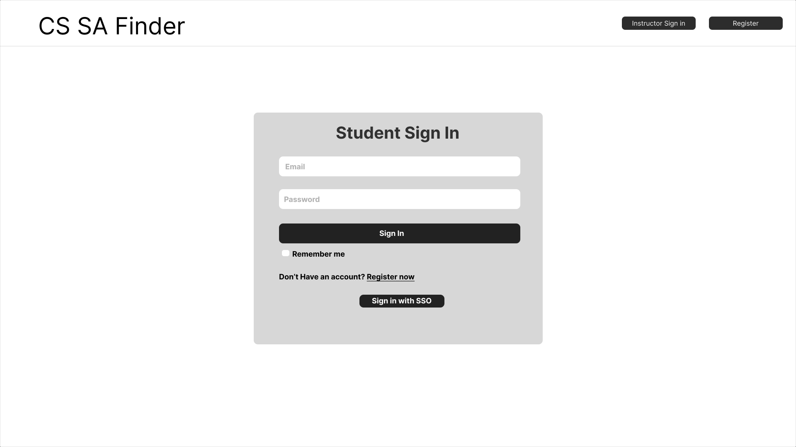
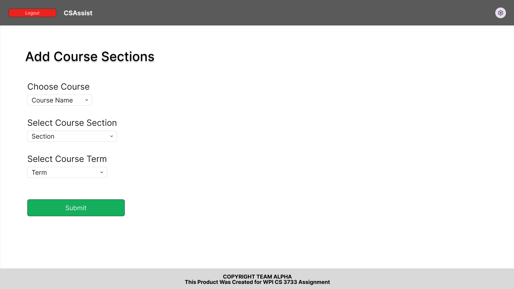

# Project Design Document

## Your Project Title
--------
Prepared by:

* `Sai Teja Sunku`,`WPI`
* `Achintya Sanjay`,`WPI`
* `Ishaan Patel`,`WPI`
* `Jake Grier`,`WPI`
---

**Course** : CS 3733 - Software Engineering 

**Instructor**: Sakire Arslan Ay

---

## Table of Contents
- [1. Introduction](#1-introduction)
- [2. Software Design](#2-software-design)
    - [2.1 Database Model](#21-model)
    - [2.2 Subsystems and Interfaces](#22-subsystems-and-interfaces)
    - [2.2.1 Overview](#221-overview)
    - [2.2.2 Interfaces](#222-interfaces)
    - [2.3 User Interface Design](#23-view-and-user-interface-design)
- [3. References](#3-references)
- [Appendix: Grading Rubric](#appendix-grading-rubric)

### Document Revision History

| Name | Date | Changes | Version |
| ------ | ------ | --------- | --------- |
|Revision 1 |2024-11-15 |Initial draft | 1.0        |
|      |      |         |         |

# 1. Introduction

Explain the purpose of this document. If this is a revision of an earlier document, please make sure to summarize what changes have been made during the revision (keep this discussion brief). 

This Design Document aims to explain software design of CSAssist web application. The software design includes:
1. Database Model
2. Subsystems and Interfaces
3. Subsystem Routes
4. User Interfaces
The database model provide information about the tables involved, fields in each table, foreign and primary keys, any association table, and multiplicity and interactions between tables.
The subsystem and interfaces provide information on how the web application is divided into different components and any dependencies between components. The subsystem is designed to have low coupling and high cohesion.
The subsystem routes gives information about the routes, decorator functions and their purpose. The user interfaces provide high level overview of how the web application looks and features present for user to interact with.

# 2. Software Design

(**Note**: For all subsections of Section-2: You should describe the design for the end product (completed application) - not only your iteration1 version. You will revise this document and add more details later.)

## 2.1 Database Model

Provide a list of your tables (i.e., SQL Alchemy classes) in your database model and briefly explain the role of each table. 

Provide a UML diagram of your database model showing the associations and relationships among tables. 

## 2.2 Subsystems and Interfaces

### 2.2.1 Overview

Describe the high-level architecture of your software:  i.e., the major subsystems and how they fit together. Provide a UML component diagram that illustrates the architecture of your software. Briefly mention the role of each subsystem in your architectural design. Please refer to the "System Level Design" lectures in Week 4. 

<kbd>
      
</kbd>

### 2.2.2 Interfaces

Include a detailed description of the routes your application will implement. 
* Brainstorm with your team members and identify all routes you need to implement for the **completed** application.
* For each route specify its “methods”, “URL path”, and “a description of the operation it implements”.  
* You can use the following table template to list your route specifications. 
* Organize this section according to your subsytem decomposition, i.e., include a sub-section for each subsytem and list all routes for that sub-section in a table.  

#### 2.2.2.1 \<Subsystem1> Routes

|   | Methods           | URL Path   | Description  |
|:--|:------------------|:-----------|:-------------|
|1. |                   |            |              |
|2. |                   |            |              |
|3. |                   |            |              |
|4. |                   |            |              |
|5. |                   |            |              |
|6. |                   |            |              |

#### 2.2.2.2 \<Subsystem2> Routes

|   | Methods           | URL Path   | Description  |
|:--|:------------------|:-----------|:-------------|
|1. |                   |            |              |
|2. |                   |            |              |
|3. |                   |            |              |
|4. |                   |            |              |
|5. |                   |            |              |
|6. |                   |            |              |

Repeat the above for other subsystems you included in your application. 

### 2.3 User Interface Design 

Provide a list of the page templates you plan to create and supplement your description with UI sketches or screenshots. Make sure to mention which user-stories in your “Requirements and Use Cases" document will utilize these interfaces for user interaction. 

1. Student sign in page This page includes a form for students to sign into their account, a button to switch to instructor sign in, and a button to register. 
User story: 1
  <kbd>      
      
  </kbd>

2. Instructor sign in page This page includes a form for instructors to sign in, a button to switch to student sign in page, and a button to register. 
User story: 2
  <kbd>      
      
  </kbd>

3. Student create account page This page includes a form for a student to create an account and register, and a button to switch to the sign in page. 
User story: 3
  <kbd>      
      
  </kbd>

4. Instructor create account page This page includes a form for a professor to create an account and register, and a button to switch to the sign in page. 
User story: 4
  <kbd>      
      
  </kbd>

5. Add course section pages This page includes a form for professors to add course sections, and a logout button. 
User Story: 9
  <kbd>      
      
  </kbd>

6. View Open SA Positions page This page includes three secions to display the three recomended levels for the open sa positions. It also has a logout button. 
User Story: 5, 6, 7
  <kbd>      
      
  </kbd>

7. Apply for SA Position page  This page includes a form for students to submit their application to open sa positions. It also has a logout button 
User Story: 8
  <kbd>      
      
  </kbd>

8. View application status page  This page allows students to view the status of all their applications and gives the option to withdraw. It also includes a logout button. 
User Story: 13, 14
  <kbd>      
      
  </kbd>

9. Create SA Position page This page includes a form for instructors to create sa positions. 
User Story: 10, 12
  <kbd>      
      
  </kbd>

10. View Student Qualifications  This page displays a selected students qualifications to an instructor 
User Story: 11
  <kbd>      
      
  </kbd>

# 3. References

Cite your references here.

For the papers you cite give the authors, the title of the article, the journal name, journal volume number, date of publication and inclusive page numbers. Giving only the URL for the journal is not appropriate.

For the websites, give the title, author (if applicable) and the website URL.

----
# Appendix: Grading Rubric
(Please remove this part in your final submission)

 * You will first  submit a draft version of this document:
    * "Project 3 : Project Design Document - draft" (5pts). 
* We will provide feedback on your document and you will revise and update it.
    * "Project 5 : Project Design Document - final" (80pts) 

Below is the grading rubric that we will use to evaluate the final version of your document. 

|**MaxPoints**| **Design** |
|:---------:|:-------------------------------------------------------------------------|
|           | Are all parts of the document in agreement with the product requirements? |
| 8         | Is the architecture of the system ([2.2.1 Overview](#221-overview)) described well, with the major components and their interfaces?         
| 8        | Is the database model (i.e., [2.1 Database Model](#21-database-model)) explained well with sufficient detail? Do the team clearly explain the purpose of each table included in the model?| 
|          | Is the document making good use of semi-formal notation (i.e., UML diagrams)? Does the document provide a clear UML class diagram visualizing the DB model of the system? |
| 18        | Is the UML class diagram complete? Does it include all classes (tables) and does it clearly mark the PK and FKs for each table? Does it clearly show the associations between them? Are the multiplicities of the associations shown correctly? ([2.1 Database Model](#21-database-model)) |
| 25        | Are all major interfaces (i.e., the routes) listed? Are the routes explained in sufficient detail? ([2.2.2 Interfaces](#222-interfaces)) |
| 13        | Is the view and the user interfaces explained well? Did the team provide the screenshots of the interfaces they built so far.  ([2.3 User Interface Design](#23-user-interface-design)) |
|           | **Clarity** |
|           | Is the solution at a fairly consistent and appropriate level of detail? Is the solution clear enough to be turned over to an independent group for implementation and still be understood? |
| 5         | Is the document carefully written, without typos and grammatical errors?  |
| 3         | Is the document well formatted? (Make sure to check your document on GitHub. You will loose points if there are formatting issues in your document.  )  |
|           |  |
| 80         | **Total** |
|           |  |