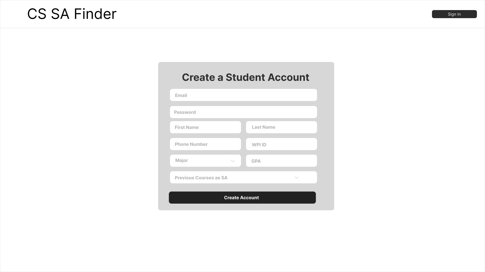
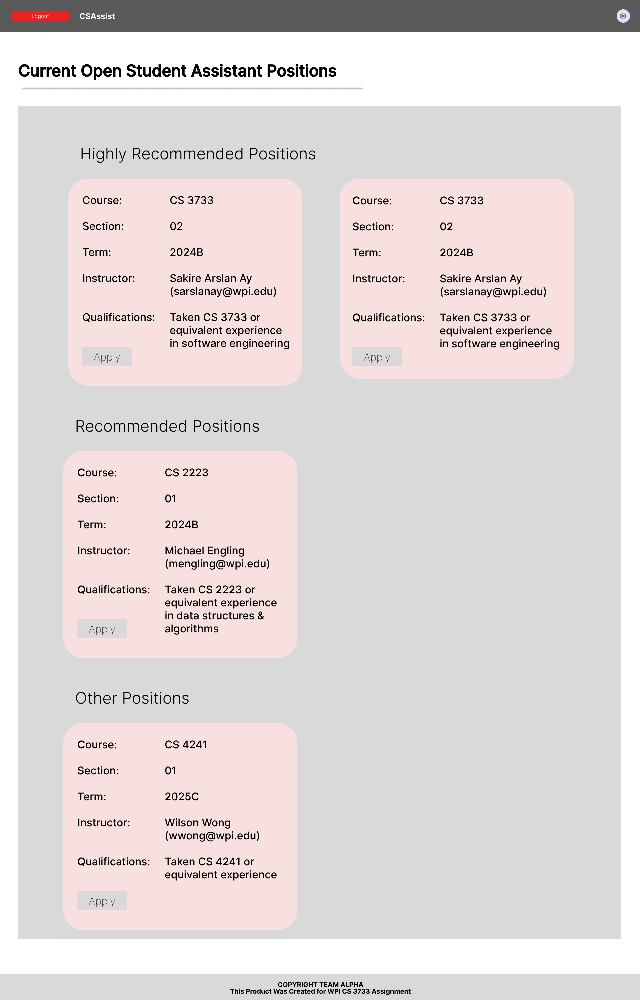
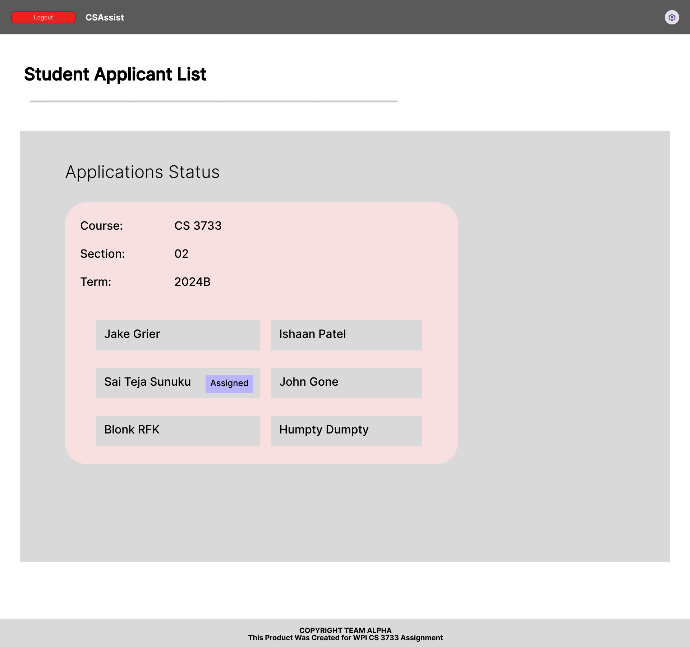

# Project Design Document

## Your Project Title: CSAssist
--------
Prepared by:

* `Sai Teja Sunku`,`WPI`
* `Achintya Sanjay`,`WPI`
* `Ishaan Patel`,`WPI`
* `Jake Grier`,`WPI`
---

**Course** : CS 3733 - Software Engineering 

**Instructor**: Sakire Arslan Ay

---

## Table of Contents
- [1. Introduction](#1-introduction)
- [2. Software Design](#2-software-design)
    - [2.1 Database Model](#21-model)
    - [2.2 Subsystems and Interfaces](#22-subsystems-and-interfaces)
    - [2.2.1 Overview](#221-overview)
    - [2.2.2 Interfaces](#222-interfaces)
    - [2.3 User Interface Design](#23-view-and-user-interface-design)
- [3. References](#3-references)
- [Appendix: Grading Rubric](#appendix-grading-rubric)

### Document Revision History

| Name       | Date       | Changes                                                          | Version |
|------------|------------|------------------------------------------------------------------|---------|
| Revision 1 | 2024-11-12 | Initial draft for section 1, 2.1, 2.2, 2.3                       | 1.0     |
| Revision 2 | 2024-11-13 | Added information to section 2.2                                 | 2.0     |
| Revision 3 | 2024-11-14 | Revised section 2.2 and added additional details                 | 3.0     |
| Revision 4 | 2024-11-15 | Added UML design for section 2.1                                 | 4.0     |
| Revision 5 | 2024-11-20 | Edited the UML Component diagram                                 | 5.0     |
| Revision 6 | 2024-11-21 | Edited the Subsystem routes to follow REST API naming convention | 6.0     |
| Revision 7 | 2024-11-22 | Updated the UML database design in section 2.1                   | 7.0     |

# 1. Introduction

This Design Document aims to explain software design of CSAssist web application. The software design includes:
1. Database Model
2. Subsystems and Interfaces
3. Subsystem Routes
4. User Interfaces 

The database model provides information about the tables involved, fields in each table, foreign and primary keys, any association table, and multiplicity and interactions between tables.
The subsystem and interfaces provide information on how the web application is divided into different components and any dependencies between components. The subsystem is designed to have low coupling and high cohesion.
The subsystem routes gives information about the routes, decorator functions and their purpose. The user interfaces provide high level overview of how the web application looks and features present for user to interact with.

# 2. Software Design

(**Note**: For all subsections of Section-2: You should describe the design for the end product (completed application) - not only your iteration1 version. You will revise this document and add more details later.)

## 2.1 Database Model
1. User
    Student and Insturctor inherit from this
    * id: the primary key
    * first name: the user's first name
    * last name: the user's last name
    * WPI_ID: the 9 digit WPI ID
    * email: the user's email
    * phone: the user's phone number, 10 digits
    * username: the user's username
    * password_hash: the user's hashed password
    * user_type: the type of user (Student or Instructor)
2. Student
    Student maintains information about students and inherits from the User class
    * id: identifier, both a primary key and a foreign key
    * GPA: the GPA of the student, expressed as a floating point
    * graduation_date: a string representing the graduation date of the student
    * assigned: a boolean value indicating if the student is assigned a SA position
    * taught: a relationship between Student and pastEnrollments, one-to-many, represents the courses a student has been an SA for previously
3. Instructor
    Instructor maintains information about instructors and inherits from the User class
    * id: identifier, both a primary key and a foreign key
    * course_sections: a relationship between Instructors and Course sections, one-to-many, represents the course sections that a instructor teaches
4. CourseSection
    * This database model will maintain information about Course sections
    * id: identifier, a primary key
    * course_number: a string including the major and number of the course, example CS1001
    * section: and integer representing the course section number
    * insturctor_id: a foreign key, the id of the insturctor that created the course section
    * term: a string representing the year and term the course will take place, example 2024B
    * positions: a relationship between Position and CourseSection, one-to-many, represents all the positions made under that course section
    * instructor: a relationship between CourseSection and Instructor, one-to-many, represents the instructor teaching the course
    * course: a relationship between Course and CourseSection, one-to-many, represents the course that this section belongs to
    * hasPosition: a function returning a boolean, true if the course has an open position
5. Position
    * This database model will maintain information about the SA positions of a course. It will maintain information about the course it is assigned to, the SA applicants, and the current SAs of the course.
    * id: a primary key
    * section_id: a foreign key, the id of the course section it is a position of
    * instructor_id: a foreign key, the id of the instructor teaching the course section that it is a position of
    * num_SAs: an integer, the number of SAs the instructor wants for the course
    * available: a boolean showing if the course is available
    * min_GPA: the minimum GPA needed to SA for the position
    * min_grade: the minimum grade aquired in the course to SA for the position
    * SA_experience: a boolean, true if the course required a student with prior SA experience
    * course_section: a relationship between Position and CourseSection, one-to-many, represents the Course that this position belongs to
  6. Application
    This model holds the information for applications created by students
    * This has a relationship with Student, which represents the student who created the Application
    * Has a relationship with Position, which represents the position the application is for
  7. Course
    * This model holds the information for courses, including the course number and title
    * Has a relationship with with CourseSection, which represents the course sections made for this course
    * Has a many to many relationship with Student, which represents the students whio have taken the course
  8. pastEnrollments
    * An interjection table between Course and Student, represents the students who have taken a course, and the courses a student has taken

<kbd>      
      
  </kbd>

## 2.2 Subsystems and Interfaces

### 2.2.1 Overview

#### Subsystem Overview
The subsystems involved in this web application are:
1. Main - handles homepage/index page for both the user roles: Student and Instructor
2. Auth - handles the login, logout, and authentication logic for both users roles Student and Instructor and redirects accordingly. 
3. Errors - displays error templates when some part of the app fails.
4. Student - handles all the operations for a Student user like applying for SA position, viewing open positions, registering profile, providing recommendations, and application management. 
5. Instructor - handles all the operations for a Instructor user like creating course section and SA position, registering profile, application management, and viewing student.
All the subsystems fit together as the flow starts from Auth for logging-in, then Main for homepage, then Student or Instructor subsystem to handle main parts of the web app, finally Auth again manages logout. All the subsystems can throw errors through Error subsystem.

#### UML Component Diagram
<kbd>
      
</kbd>

### 2.2.2 Interfaces

#### 2.2.2.1 Student Routes

|   | Methods           | URL Path                                | Description                                                                                     |
|:--|:------------------|:----------------------------------------|:------------------------------------------------------------------------------------------------|
|1. |view_positions()   | /positions                              | Student can view open positions for SA                                                          
|2. |view_recommend()   | /positions/recommendations              | Students can view recommended positions to apply for based on their credentials                 |
|3. |view_SA_details()  | /positions/<position_id>/details        | Students can check the details of each SA position based on position id                         |
|4. |check_app_status() | /applications/<application_id>/status   | Students can check status of submitted SA application(s) based on application id                |
|5. | withdraw_app()    | /applications/<application_id>/withdraw | Students can withdraw existing submitted applications that they created based on application id |

#### 2.2.2.2 Main Routes

|   | Methods           | URL Path          | Description                         |
|:--|:------------------|:------------------|:------------------------------------|
|1. | student_index()           | /student/index    | Home Page for Student |
|2. | instructor_index()           | /instructor/index | Home Page for Instructor |

#### 2.2.2.3 Auth Routes

|    | Methods     | URL Path                  | Description                                                                                                                                                                                                                       |
|:---|:------------|:--------------------------|:----------------------------------------------------------------------------------------------------------------------------------------------------------------------------------------------------------------------------------|
| 1. | login()     | /user/login               | Authenticates the user based on username and password and redirects to homepage according to their role on success. If the validation fails because of wrong credentials or user does not exist, then error message is displayed. |
| 2. | logout()    | /user/logout              | Logs out the user from the session and redirect back to the login page.                                                                                                                                                           |
| 3. | login_sso() | /user/loginsso            | Allows user to login using Azure SSO instead of email and password.                                                                                                                                                               |
|4. | instructor_register()    | /user/instructor/register | Create instructor profile with username, password, name, WPI ID, email, and phone number. After submitting the data is stored into database and the username and password can be used for logging-in. |
|5. |   student_register()                | /user/student/register    |  Students can create student profiles to access SA positions information and application pages            |

#### 2.2.2.4 Instructor Routes

|   | Methods                  | URL Path                                             | Description                                                                                                                                                                             |
|:--|:-------------------------|:-----------------------------------------------------|:----------------------------------------------------------------------------------------------------------------------------------------------------------------------------------------|
|1. | add_student(student_id)  | /positions/<position_id>/student/<student_id>        | Adds the selected student to the open SA position based on id's only if the student is unassigned, else throws an error. Saves the student for that position and mark as assigned.      |
|2. | view_student(student_id) | /applications/student/<student_id>                   | Displays the student information and qualifications for the positions.                                                                                                                  |
|3. | view_allstudents()       | /applications                                        | Displays all the students who applied for every SA position that the instructor created.                                                                                                |
|4. | create_position()        | /positions/<course_section_id>                       | Create a SA position for the course that the instructor created and save the data in database. SA position form includes course section, number of SAs, and qualifications information. |
|5. | create_course()          | /course_section                                      | Create course section by selecting course from course catalog, course section, and the term. After submitting the course is saved into database.                                        |
|6. | accept_student() | /positions/<position_id>/student/<student_id>/accept | Accepts the selected student for the applied SA position                                                                                                                                |
|7. | reject_student() | /positions/<position_id>/student/<student_id>/reject | Rejects the selected student for the applied SA position                                                                                                                                |

#### 2.2.2.5 Error Routes

|    | Methods           | URL Path | Description                                                         |
|:---|:------------------|:---------|:--------------------------------------------------------------------|
| 1. | not_found_error() | /404     | Displays 404 error template                                         |
| 2. | internal_error()  | /500     | Displays 500 error template                                         |

### 2.3 User Interface Design 

1. Student sign in page This page includes a form for students to sign into their account, a button to switch to instructor sign in, and a button to register. 
User story: 1
  <kbd>      
      
  </kbd>

2. Instructor sign in page This page includes a form for instructors to sign in, a button to switch to student sign in page, and a button to register. 
User story: 2
  <kbd>      
      
  </kbd>

3. Student create account page This page includes a form for a student to create an account and register, and a button to switch to the sign in page. 
User story: 3
  <kbd>      
      
  </kbd>

4. Instructor create account page This page includes a form for a professor to create an account and register, and a button to switch to the sign in page. 
User story: 4
  <kbd>      
      
  </kbd>

5. Add course section pages This page includes a form for professors to add course sections, and a logout button. 
User Story: 9
  <kbd>      
      
  </kbd>

6. View Open SA Positions page This page includes three secions to display the three recomended levels for the open sa positions. It also has a logout button. 
User Story: 5, 6, 7
  <kbd>      
      
  </kbd>

7. Apply for SA Position page  This page includes a form for students to submit their application to open sa positions. It also has a logout button 
User Story: 8
  <kbd>      
      
  </kbd>

8. View application status page  This page allows students to view the status of all their applications and gives the option to withdraw. It also includes a logout button. 
User Story: 13, 14
  <kbd>      
      
  </kbd>

9. Create SA Position page This page includes a form for instructors to create sa positions. 
User Story: 10, 12
  <kbd>      
      
  </kbd>

10. View Student Qualifications  This page displays a selected students qualifications to an instructor 
User Story: 11
  <kbd>      
      
  </kbd>

# 3. References

1. Draw.io - free flowchart maker and diagrams online. Flowchart Maker & Online Diagram Software. (n.d.). https://app.diagrams.net/ 
2. Gupta, L. (2023, November 4). REST API URI naming conventions and best practices. REST API Tutorial. https://restfulapi.net/resource-naming/ 
3. Pethiyagoda, N. (2022, September 26). REST API naming conventions and best practices. Medium. https://medium.com/@nadinCodeHat/rest-api-naming-conventions-and-best-practices-1c4e781eb6a5 

----
# Appendix: Grading Rubric
(Please remove this part in your final submission)

 * You will first  submit a draft version of this document:
    * "Project 3 : Project Design Document - draft" (5pts). 
* We will provide feedback on your document and you will revise and update it.
    * "Project 5 : Project Design Document - final" (80pts) 

Below is the grading rubric that we will use to evaluate the final version of your document. 

|**MaxPoints**| **Design** |
|:---------:|:-------------------------------------------------------------------------|
|           | Are all parts of the document in agreement with the product requirements? |
| 8         | Is the architecture of the system ([2.2.1 Overview](#221-overview)) described well, with the major components and their interfaces?         
| 8        | Is the database model (i.e., [2.1 Database Model](#21-database-model)) explained well with sufficient detail? Do the team clearly explain the purpose of each table included in the model?| 
|          | Is the document making good use of semi-formal notation (i.e., UML diagrams)? Does the document provide a clear UML class diagram visualizing the DB model of the system? |
| 18        | Is the UML class diagram complete? Does it include all classes (tables) and does it clearly mark the PK and FKs for each table? Does it clearly show the associations between them? Are the multiplicities of the associations shown correctly? ([2.1 Database Model](#21-database-model)) |
| 25        | Are all major interfaces (i.e., the routes) listed? Are the routes explained in sufficient detail? ([2.2.2 Interfaces](#222-interfaces)) |
| 13        | Is the view and the user interfaces explained well? Did the team provide the screenshots of the interfaces they built so far.  ([2.3 User Interface Design](#23-user-interface-design)) |
|           | **Clarity** |
|           | Is the solution at a fairly consistent and appropriate level of detail? Is the solution clear enough to be turned over to an independent group for implementation and still be understood? |
| 5         | Is the document carefully written, without typos and grammatical errors?  |
| 3         | Is the document well formatted? (Make sure to check your document on GitHub. You will loose points if there are formatting issues in your document.  )  |
|           |  |
| 80         | **Total** |
|           |  |