# Software Requirements and Use Cases

## Your Project Title: CSAssist
--------
Prepared by:

* `Sai Teja Sunku`,`WPI`
* `Achintya Sanjay`,`WPI`
* `Ishaan Patel`,`WPI`
* `Jake Grier`,`WPI`

---

**Course** : CS 3733 - Software Engineering

**Instructor**: Sakire Arslan Ay

---

## Table of Contents
- [1. Introduction](#1-introduction)
- [2. Requirements Specification](#2-requirements-specification)
  - [2.1 Customer, Users, and Stakeholders](#21-customer-users-and-stakeholders)
  - [2.2 User Stories](#22-user-stories)
  - [2.3 Use Cases](#23-use-cases)
- [3. User Interface](#3-user-interface)
- [4. Product Backlog](#4-product-backlog)
- [4. References](#4-references)
- [Appendix: Grading Rubric](#appendix-grading-rubric)

## Document Revision History

| Name       | Date       | Changes                                                                        | Version |
|------------|------------|--------------------------------------------------------------------------------|---------|
| Revision 1 | 2024-11-03 | Worked on Introduction, User Stores, and Use Cases                             | 1.0     |
| Revision 2 | 2024-11-04 | Worked on User Interfaces using Figma and Product and Sprint Backlog on Github | 2.0     |
| Revision 3 | 2024-11-05 | Worked on Use Cases and Reviewed Requirements Document                         | 3.0     |
| Revision 4 | 2024-11-06 | Proofread Use Cases and Requirements Document                                  | 4.0     |

----
# 1. Introduction

The software being developed is a web application for Computer Science department to recruit undergraduate student assistants (SAs) for the
introductory level courses and lab sections. This product aims to eliminate the manual process of applying and processing for an SA position.
In this web application students who are interested in SA positions will create accounts and enter their contact
information as well as their course preferences for student assistantships. In addition, instructors will be able to choose their student assistants among the students who are
interested in their courses. The web application can be accessed from anywhere at anytime using any device. The application's benefits include:  
- Secured login system
- Look at open SA positions
- Students can apply for open SA positions
- Display information for each SA position
- Identify students that match the position
- Recommend SA positions to students
- View application status
- Withdraw pending applications if necessary for students

The application can simplify the process for students and professors.

----
# 2. Requirements Specification

## 2.1 Customer, Users, and Stakeholders

- The customers for this product are the undergraduate students who are interested in being an SA for a course.

- The stakeholder is the Computer Science department at WPI, who want to make the process for recruiting student assistants easier 

- The users of the software are the students who are interested in being a student assistant, and the instructor that want to create applications for their courses, and accept students to be a student assistant

----
## 2.2 User Stories

1. **Student Login:** As a Student, I want to be able to login to the site so that I can use the site
2. **Professor Login:** As a Professor, I want to be able to login to the site so that I can use the site
3. **Student Profile:** As a Student, I want to be able to create my profile so that I can be recommended best courses and the professor can see if my profile matches the requirement
4. **Professor Profile:** As a Professor, I want to be able to create my profile so that the student can see my information
5. **View Open SA Positions:** As a Student, I want to view all open SA positions so that I decide which ones I am interested in
6. **View SA Position Details:** As a Student, I want to view all the details of every open SA position so that I know if I can meet the qualifications
7. **View SA Position Recommendations:** As a Student, I want to be recommended SA positions that match my profile 
8. **Apply For SA Position:** As a Student, I want to apply for the open SA positions
9. **Create Course:** As a Professor, I want to create course sections so that students can view the course information
10. **Create SA Positions:** As a Professor, I want to create SA positions for a particular course so that students can apply for a particular course
11. **View Student Applications:** As a Professor, I want to view all students applied for a SA position so that I know if the student took the course and if he/she got an A, to determine if good fit
12. **Add Student To A Position:** As a Professor, I want to add a student to the SA position so that I can register students who haven't been assigned a position
13. **Check Application Status:** As a Student, I want to check status of my applications so that I know which applications are approved, rejected or still pending
14. **Withdraw Application:** As a Student, I want to withdraw my pending applications so that I'm not in the system for positions as I'm no longer interested in

----
## 2.3 Use Cases

Actors Involved:
 - Students are users that are computer science students at WPI looking for SA Positions to apply to.
 - Professors are instructors at WPI looking to find students to work as SAs in their courses

| Use case # 1               |                                                                                                                                                                                                                                                                                                                  |
|----------------------------| ------------------------------------------------------------------------------------------------------------------------------------------------------------------------------------------------------------------------------------------------------------------------------------------------------------------|
| Name                       | Student Login                                                                                                                                                                                                                                                                                            |
| Participating actor        | Student                                                                                                                                                                                                                                                                                                        |
| Entry condition(s)         | The student selects the button for the login page of the application.                                                                                                                                                                                                           |
| Exit condition(s)          | The student is successfully logged into their account.                                                                                                                                                                                                                     |
| Flow of events             | 1. The student visits the login page.  2. The system prompts the user to enter their username and password.  3. The user submits their username and password into the page.  4. The system logs into the account associated with that username and password. |
| Alternative flow of events | 1. In step 2, the student can instead choose to login to their account using the Azure Single Sign on service.  2. In step 4, the student can fail to log into the account if the account does not exist, or the wrong password is entered 3. The user can leave the page at any time during step 2.                                      |
| Iteration #                | 1                                                                                                                                                                                                                                                                                                              |
<!------------------------------------------------------------------------>
| Use case # 2               |                                                                                                                                                                                                                                                                                                                  |
|----------------------------|------------------------------------------------------------------------------------------------------------------------------------------------------------------------------------------------------------------------------------------------------------------------------------------------------------------|
| Name                       | Professor Login                                                                                                                                                                                                                                                                                            |
| Participating actor        | Professor                                                                                                                                                                                                                                                                                                        |
| Entry condition(s)         | The professor selects the button for the login page of the application.                                                                                                                                                                                                           |
| Exit condition(s)          | The professor is successfully logged into their account.                                                                                                                                                                                                                     |
| Flow of events             | 1. The professor visits the login page.  2. The system prompts the user to enter their username and password.  3. The user submits their username and password into the page.  4. The system logs into the account associated with that username and password. |
| Alternative flow of events | 1. In step 2, the professor can instead choose to login to their account using the Azure Single Sign on service.  2. In step 4, the professor can fail to log into the account if the account does not exist, or the wrong password is entered 3. The user can leave the page at any time during step 2.                                     |
| Iteration #                | 1                                                                                                                                                                                                                                                                                                              |
<!------------------------------------------------------------------------>
| Use case # 3               |                                                                                                                                                                                                                                                                                                                  |
|----------------------------|------------------------------------------------------------------------------------------------------------------------------------------------------------------------------------------------------------------------------------------------------------------------------------------------------------------|
| Name                       | Create Student Profile                                                                                                                                                                                                                                                                                            |
| Participating actor        | Student                                                                                                                                                                                                                                                                                                        |
| Entry condition(s)         | The student selects the button for the create account page of the application.                                                                                                                                                                                                           |
| Exit condition(s)          | The student successfully creates an account.                                                                                                                                                                                                                    |
| Flow of events             | 1. The student visits the create account page.  2. The system prompts the student to enter their username, password, name, WPI ID, email, and phone number. It also will ask for students to enter their major, cumulative GPA, and expected graduation date, and previous SA positions served.  3. The user submits their information into the page.  4. The system creates an account, which contains the provided information. |
| Alternative flow of events | 1. In step 3, the page will show an error and not submit if any fields are not filled out.  2. The user can leave the page at any time during step 2.                                     |
| Iteration #                | 1                                                                                                                                                                                                                                                                                                              |
<!------------------------------------------------------------------------>
| Use case #4|                                                                                                                                                                                                                                                                                                                |
|----------------------------|------------------------------------------------------------------------------------------------------------------------------------------------------------------------------------------------------------------------------------------------------------------------------------------------------------------|
| Name                       | Create Professor Profile                                                                                                                                                                                                                                                                                            |
| Participating actor        | Professor                                                                                                                                                                                                                                                                                                        |
| Entry condition(s)         | The professor selects the button for the create account page of the application.                                                                                                                                                                                                           |
| Exit condition(s)          | The professor successfully creates an account.                                                                                                                                                                                                                    |
| Flow of events             | 1. The professor visits the create account page.  2. The system prompts the professor to enter their username, password, name, WPI ID, email, and phone number.  3. The user submits their information into the page.  4. The system creates an account, which contains the provided information. |
| Alternative flow of events | 1. In step 3, the page will show an error and not submit if any fields are not filled out.  2. The user can leave the page at any time during step 2.                                     |
| Iteration #                | 1                                                                                                                                                                                                                                                                                                              |
<!------------------------------------------------------------------------>
| Use case # 5      |   |
| ------------------ |--|
| Name              | View open SA Positions     |
| Participating actor  | Students  |
| Entry condition(s)     | Student has created an account and is logged in  |
| Exit condition(s)           | The web applications displays a list of open SA Positons  |
| Flow of events |  1. The student logs in to their account 2. The student selects the button View Open SA Positions   3. The System gets the open SA Position from the database 4. The System displays a list of open SA positions|
| Alternative flow of events    |1. The Student is not logged in to an account: They will be redirected to the sign in page and a message will flash saying "Please log in to access this page" 2. No SA Positions are open: A message will flash saying "No open positions found" 3. There is an error fetching the data from the db: A message will flash saying "Error gathering information, please try again" |
| Iteration #         | 2  |
                                                                        
<!------------------------------------------------------------------------->
| Use case # 6      |   |
| ------------------ |--|
| Name              | View Details of SA Positon  |
| Participating actor  | Student  |
| Entry condition(s)     |  Student has created an account and is logged in  |
| Exit condition(s)           | The web applications displays the details of the selected position |
| Flow of events |   1. The student logs in to their account 2. The student selects to view all open SA Positions 3. The system gets all open sa positions from the DB 4. The system displays a list of all open SA Positions 5. The Student selects "View Details" on one of the SA Positions 6. The system gets the data from that position in the db 7. The system displays the details of that position to the student.   |
| Alternative flow of events    |1. The Student is not logged in to an account: They will be redirected to the sign in page and a message will flash saying "Please log in to access this page" 2. No SA Positions are open: A message will flash saying "No open positions found" 3. There is an error fetching the data from the db: A message will flash saying "Error gathering information, please try again" 4. The student selects to view the details of a positon but it is no longer found in the db: Flash error saying "Position not found" |
| Iteration #         | 2  |

<!------------------------------------------------------------------------->
| Use case # 7      |   |
| ------------------ |--|
| Name              | View Recommended Positions  |
| Participating actor  | Student  |
| Entry condition(s)     | Student has created an account and is logged in  |
| Exit condition(s)           | The web applications displays a list of open positions ranked on the recomendation algorithm  |
| Flow of events |1. The student logs in to their account 2. The student selects to view all open SA Positions 3. The system gets all open sa positions from the DB 4. The web application uses the recommendation algortithm to split positions into Highly Recommended, Recommended, and other. 5. The web application displays different sections of recommendations. |
| Alternative flow of events    | 1. The Student is not logged in to an account: They will be redirected to the sign in page and a message will flash saying "Please log in to access this page" 2. No SA Positions are open: A message will flash saying "No open positions found" 3. There is an error fetching the data from the db: A message will flash saying "Error gathering information, please try again" 4. The student is not recommeneded for any positions, The sections in recommended will say "no positions found"  |
| Iteration #         | 3  |

<!------------------------------------------------------------------------->
| Use case # 8      |   |
| ------------------ |--|
| Name              | Apply for SA Positions |
| Participating actor  | Student  |
| Entry condition(s)     | Student has created an account and is logged in |
| Exit condition(s)           | The system adds the students application to the db |
| Flow of events | 1. The student logs in to their account 2. The student selects to view all open SA Positions 3. The system gets all open sa positions from the DB 4. The system displays a list of all open SA Positions 5. The student selects the "Apply" button on the selected position 6. The system displays the applicaton form for the selected position. 7. The student enters the grade they earned in the course. 8. The student enters the year and term they took the course. 9. The student enters the year and term they are applying for. 10. The student selects Submit. 11. The system adds the application to the db. |
| Alternative flow of events    | 1. The Student is not logged in to an account: They will be redirected to the sign in page and a message will flash saying "Please log in to access this page" 2. No SA Positions are open: A message will flash saying "No open positions found" 3. There is an error fetching the data from the db: A message will flash saying "Error gathering information, please try again" 4. The student does not enter all fields: Flash message saying "Please complete all fields before submitting." 5. The student cancels the application before submitting the form: They will be redirected to the open positions page|
| Iteration #         | 2  |

| Use case # 9               |                                                                                                                                                                                                                                                                                                                  |
|----------------------------|------------------------------------------------------------------------------------------------------------------------------------------------------------------------------------------------------------------------------------------------------------------------------------------------------------------|
| Name                       | Create Course                                                                                                                                                                                                                                                                                                    |
| Participating actor        | Professor                                                                                                                                                                                                                                                                                                        |
| Entry condition(s)         | The user is logged in to the application and opened the create course page.                                                                                                                                                                                                                                      |
| Exit condition(s)          | The new created course is displayed correctly with all the information entered by professor.                                                                                                                                                                                                                     |
| Flow of events             | 1. The user chooses the create course option.  2. The system prompts the user to choose course number, section, and term from the pre-created list of courses.  3. The user submits the chosen course number, section, and term.  4. The system adds the course and displays the new course created. |
| Alternative flow of events | 1. In step 2, the desired course for the professor exists in the predetermined list of courses.  2. The user can abort creating the course at any time during steps 2 or 3.                   |
| Iteration #                | 1                                                                                                                                                                                                                                                                                                              |

| Use case # 10              |                                                                                                                                                                                                                                                                                                                                                                                                                                                                                                                  |
|----------------------------|------------------------------------------------------------------------------------------------------------------------------------------------------------------------------------------------------------------------------------------------------------------------------------------------------------------------------------------------------------------------------------------------------------------------------------------------------------------------------------------------------------------|
| Name                       | Create SA Positions                                                                                                                                                                                                                                                                                                                                                                                                                                                                                              |
| Participating actor        | Professor                                                                                                                                                                                                                                                                                                                                                                                                                                                                                                        |
| Entry condition(s)         | The user is logged in to the application and opened the create SA positions page.                                                                                                                                                                                                                                                                                                                                                                                                                                |
| Exit condition(s)          | The SA position is successfully added to a specific course with all the correct information of the qualifications entered by the professor.                                                                                                                                                                                                                                                                                                                                                                      |
| Flow of events             | 1. The user chooses the create SA position option.  2. The system prompts the user to enter course section  3. The professor enters the course section for which SAships needs to be added.  4. The system prompts the user to enter number of SAs and qualifications needed for that particular position.  5. The user fills out all the SA position information and submits.  6. The system displays a success message by adding the SA position to the course specified by the professor. |
| Alternative flow of events | 1. In step 2, the user can create SA positions only for the courses created by them. If the user chooses a section that was not created by them, then the system throws an error and does not allow to add SAships.  2. In step 4, the user can enter as many as qualifications needed.  3. The user can create multiple SA positions for multiple course sections that were created by the same user.  4. The user can abort creating SA Position at any time during steps 2, 3, 4, or 5.           |
| Iteration #                | 1                                                                                                                                                                                                                                                                                                                                                                                                                                                                                                                |

| Use case # 11              |                                                                                                                                                                                                                                                                                                                                                                                                               |
|----------------------------|---------------------------------------------------------------------------------------------------------------------------------------------------------------------------------------------------------------------------------------------------------------------------------------------------------------------------------------------------------------------------------------------------------------|
| Name                       | View Student Applications                                                                                                                                                                                                                                                                                                                                                                                     |
| Participating actor        | Professor                                                                                                                                                                                                                                                                                                                                                                                                     |
| Entry condition(s)         | The user is logged in to the application and opened view student applications page.                                                                                                                                                                                                                                                                                                                           |
| Exit condition(s)          | Display of all the student applications with student's profile information who applied for the SA position for that particular professor.                                                                                                                                                                                                                                                                     |
| Flow of events             | 1. The user chooses view student applications option.  2. The system displays all the student applications for all the course sections handled by that specific user and also shows if a student applicant is already assigned to different course.  3. The user can select a particular student to view student's profile.  4. The system displays student's profile with all their information. |
| Alternative flow of events | 1. In step 2, the system only displays student applications that are pending for approval from the professor.                                                                                                                                                                                                                                                                                                 |
| Iteration #                | 2                                                                                                                                                                                                                                                                                                                                                                                                           |

| Use case # 12      |                                                                                                                                                                            |
| ------------------ |----------------------------------------------------------------------------------------------------------------------------------------------------------------------------|
| Name              | Add Student To A Position                                                                                                                                              |
| Participating actor  | Professor                                                                                                                                                                  |
| Entry condition(s)     | Faculty user logged in and is on the page listing students that applied.                                                                                                   |
| Exit condition(s)           | Prompt the screen that student was successfully added to course                                                                                                            |
| Flow of events | 1. Faculty user views list of students that applied for SA positions.  2. Faculty user views qualifications of candidate.  3. Faculty user clicks on a student to add to a course |
| Alternative flow of events    | 1. Faculty reverts to the previous page  2. The user can only choose the student who has not been yet assigned to any SAship position for any course.                  |
| Iteration #         | 3                                                                                                                                                                          |

| Use case # 13      |                                                                                                                                 |
| ------------------ |---------------------------------------------------------------------------------------------------------------------------------|
| Name              | Check Application Status                                                                                                        |
| Participating actor  | Student                                                                                                                         |
| Entry condition(s)     | User logs in with username and password and then selects application page                                                       |
| Exit condition(s)           | User clicks on another page (such as withdraw application)                                                                      |
| Flow of events | 1. User scrolls down to each application                                                                                        |
| Alternative flow of events   | 1. Each application displays individual status  2. User submits new application, which will newly show as pending application |
| Iteration #         | 3                                                                                                                               |

| Use case # 14      |                                                                                                                                                                                                                                                                                                                 |
| ------------------ |-----------------------------------------------------------------------------------------------------------------------------------------------------------------------------------------------------------------------------------------------------------------------------------------------------------------|
| Name              | Withdraw Application                                                                                                                                                                                                                                                                                            |
| Participating actor  | Student                                                                                                                                                                                                                                                                                                         |
| Entry condition(s)     | User logs in with username and password and clicks on applications page                                                                                                                                                                                                                                         |
| Exit condition(s)           | User is redirected to applications page showing remaining applications status                                                                                                                                                                                                                                   |
| Flow of events | 1. User is on the application page  2. User scrolls down to part of the page displaying submitted pending applications  3. User selects option to withdraw  4. System prompts to confirm withdrawal  5. User selects confirm option  6. User is prompted successful withdrawal of application |
| Alternative flow of events    | 1. User selects cancel on withdrawal confirmation prompt  2. User is prompted application withdrawal cancelled                                                                                                                                                                                                   |
| Iteration #         | 3                                                                                                                                                                                                                                                                                                               |

----
# 3. User Interface
  
#### Create Student Profile Page
  <kbd>
      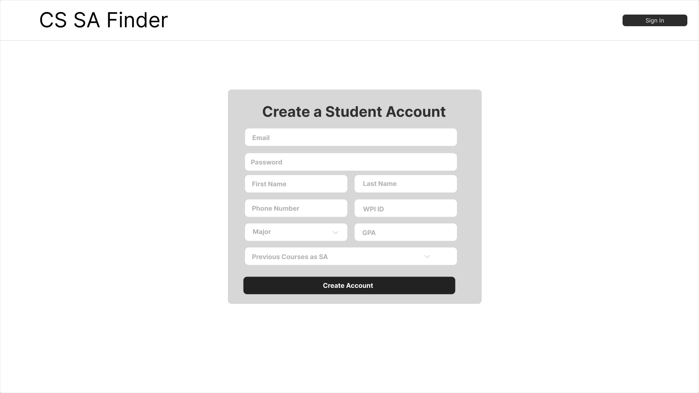
  </kbd>

#### Student Sign In Page
  <kbd>      
      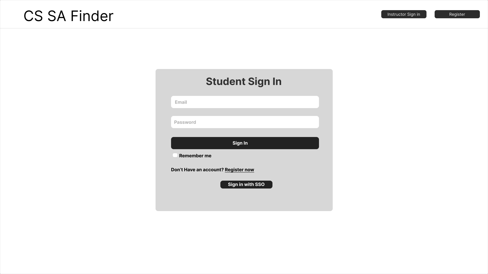
  </kbd>

#### Create Instructor Profile Page
  <kbd>      
      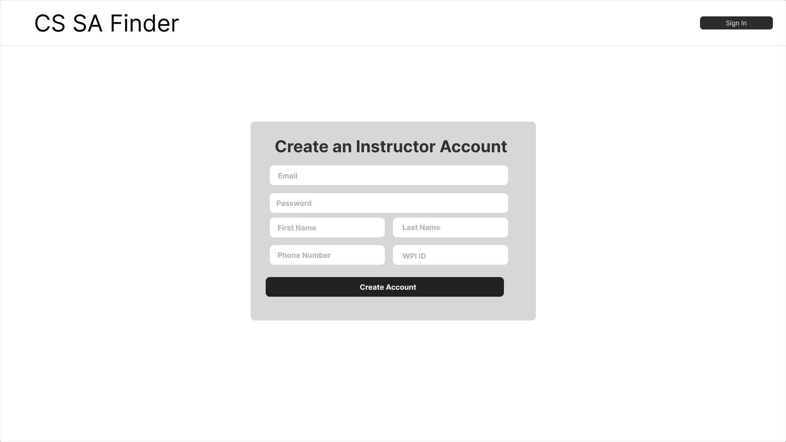
  </kbd>

#### Instructor Sign In Page
  <kbd>      
      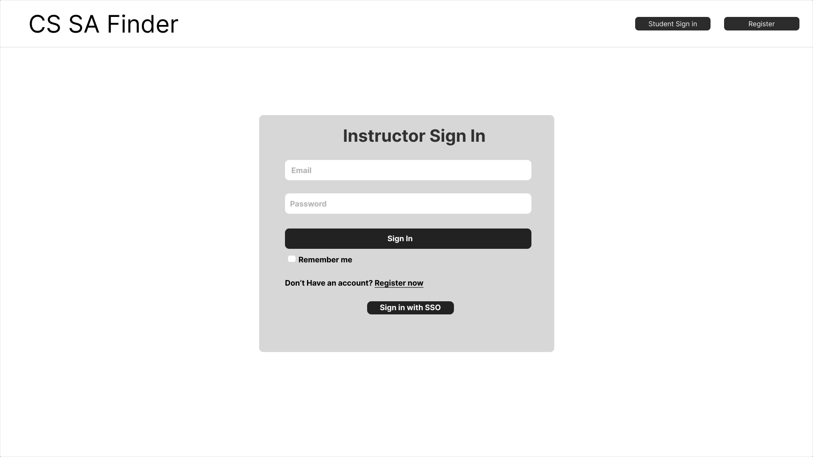
  </kbd>

#### Add Course Sections  
  <kbd>
      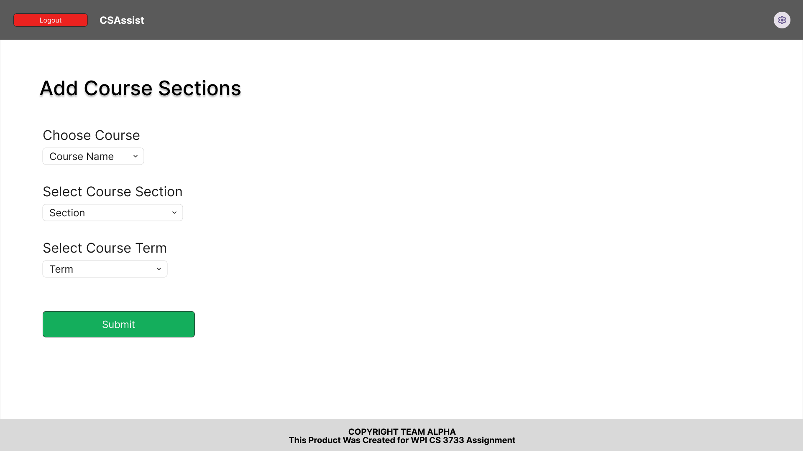
  </kbd>

  #### View Open SA Positions
  <kbd>
      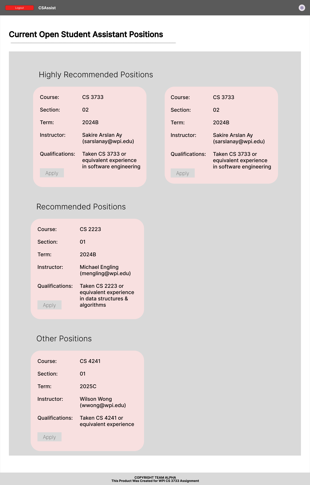
  </kbd>

#### Apply For SA Position
  <kbd>
      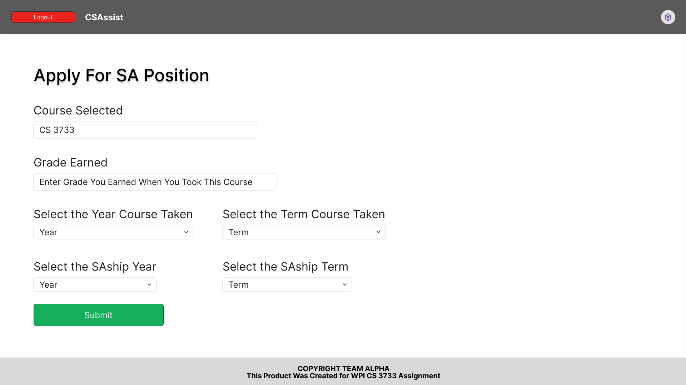
  </kbd>

 #### View SA Applications Status
  <kbd>
      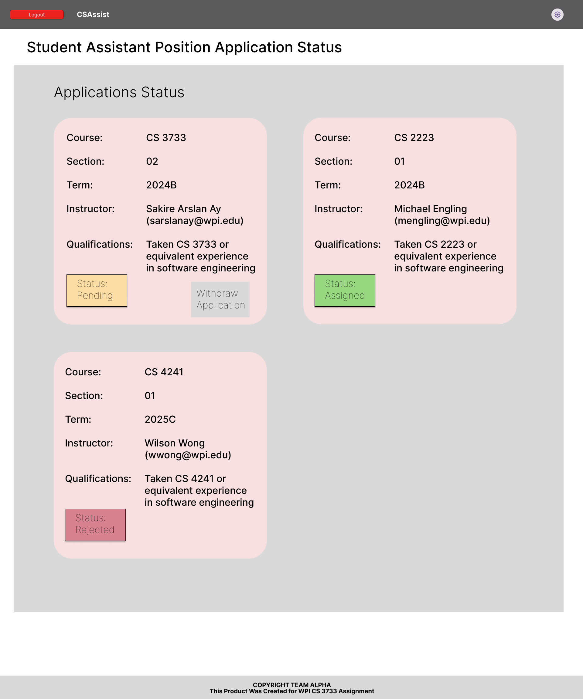
  </kbd> 

#### Create SA Position
  <kbd>
      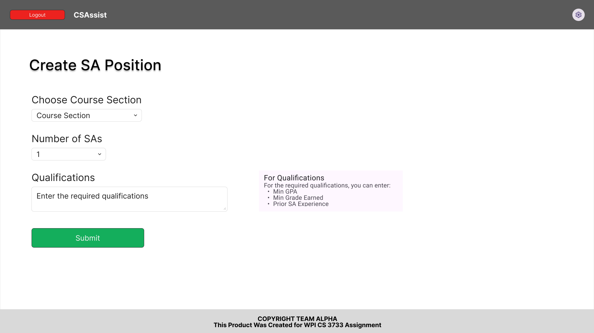
  </kbd>

  #### View Student Applicants List
  <kbd>
      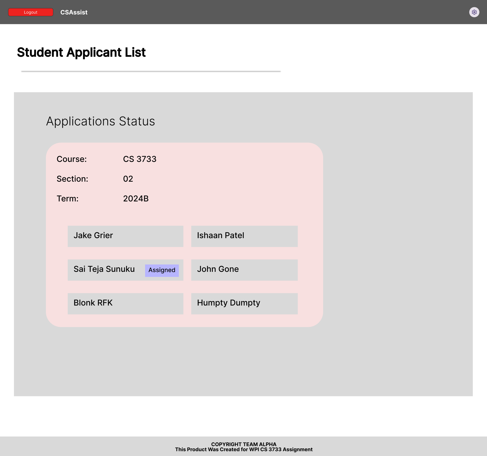
  </kbd>

#### View Student Qualifications
  <kbd>
      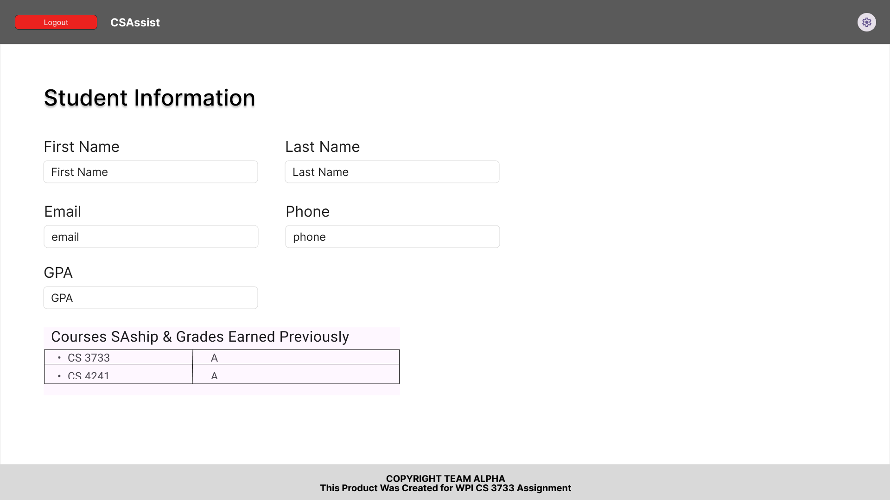
  </kbd>

      

  
  
----
# 4. Product Backlog
https://github.com/WPI-CS3733-2024B/termproject-alpha/issues

----
# 5. References

- The Collaborative Interface Design Tool. Figma. (n.d.). https://www.figma.com/ 

----